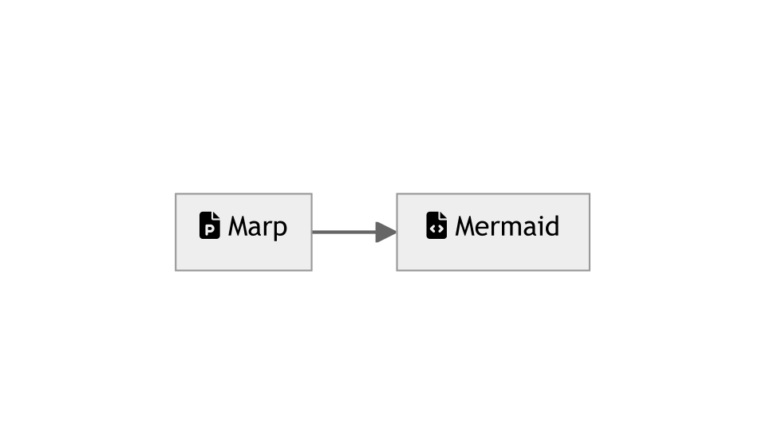

# Mermarpid

This is a boilerplate for a [Marp](https://marp.app/) presentation with [Mermaid](https://mermaid-js.github.io/mermaid/#/) diagrams
with [FontAwesome](https://fontawesome.com/) icons. It aims to solve [these](
https://github.com/marp-team/marp-core/issues/139) sorts of issues.



## Usage
This boilerplate allows you to write chapters and have them merged in order into a single pdf with `npm run build`.

```
project
├── slides // this is where you write your slides
|   ├── 1-first_chapter.md
|   ├── 2-second_chapter.md
|   └── ...
├── out // this is where you get your pdfs
|   ├── 1-first_chapter.pdf
|   ├── 2-second_chapter.pdf
|   └── ...
└── merged.pdf // this is your merged pdf
```

You can preview the result in vscode with the included `.vscode/settings.json` file.

The utility that allows this is `join_pdfs.js` and i'm looking forward to add an *outline* feature to it.

You can change the name of the `merged.pdf` file in `package.json`

## Suggested Vscode extensions

- [Markdown All in One](https://marketplace.visualstudio.com/items?itemName=yzhang.markdown-all-in-one)

- [Markdown Preview Mermaid Support](https://marketplace.visualstudio.com/items?itemName=bierner.markdown-mermaid)

- [Marp for VS Code](https://marketplace.visualstudio.com/items?itemName=marp-team.marp-vscode)


## Examples

I'm using this boilerplate for my [Javascript course](https://github.com/iacobucci/sviluppo-web-in-js)